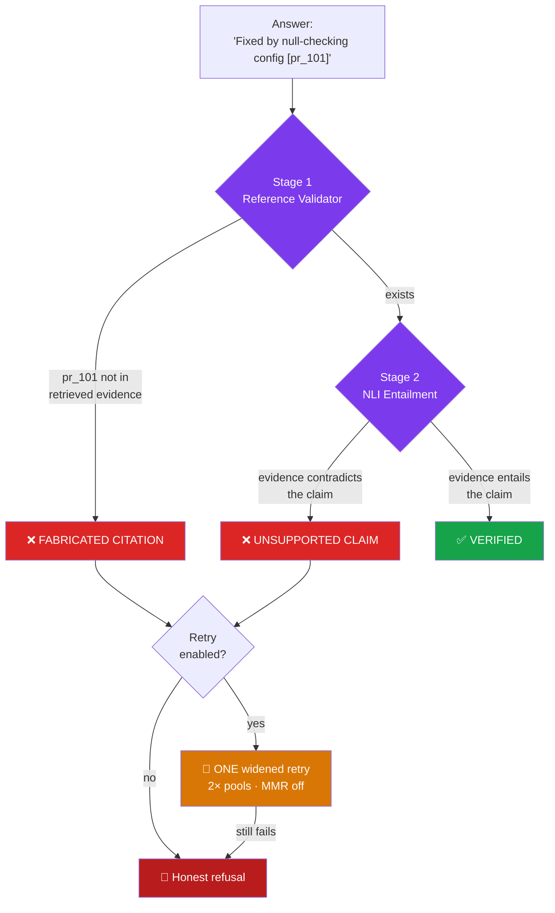
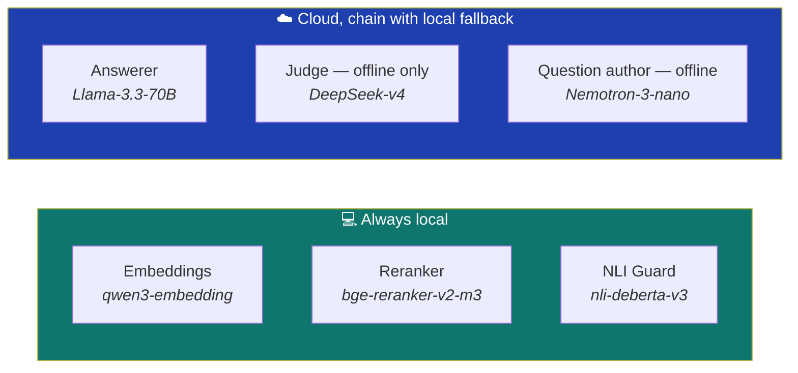
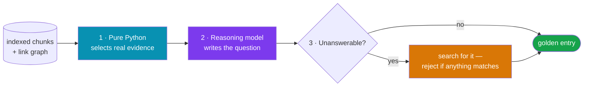

<div align="center">

# 🧠 RepoMind

### Ask a GitHub repository *why* it evolved the way it did

**Git tells you _what_ changed and _who_ changed it. RepoMind tells you _why_.**

Answers are grounded in real commits, pull requests, issues, reviews and releases —
with clickable citations, and a hallucination guard that **refuses to answer rather than guess**.

<br/>

[](https://www.python.org/)
[](https://streamlit.io/)
[](https://ollama.com/)
[](https://www.trychroma.com/)
[](https://pytorch.org/)

[](#testing)
[](#results)
[](#how-the-benchmark-is-built)
[](#privacy-and-offline-operation)
[](LICENSE)

<br/>

**[Quick Start](#quick-start)** ·
**[Architecture](#architecture)** ·
**[Results](#results)** ·
**[Limitations](#honest-limitations)** ·
**[Docs](#documentation)**

</div>

---

## Contents

- [The problem](#the-problem)
- [What makes it different](#what-makes-it-different)
- [See it work](#see-it-work)
- [Architecture](#architecture)
  - [Retrieval: why two search engines](#retrieval-why-two-search-engines)
  - [The hallucination guard](#the-hallucination-guard)
- [Results](#results)
- [Honest limitations](#honest-limitations)
- [Tech stack](#tech-stack)
- [Privacy and offline operation](#privacy-and-offline-operation)
- [Quick start](#quick-start)
- [Verification and testing](#verification-and-testing)
- [Project structure](#project-structure)
- [How the benchmark is built](#how-the-benchmark-is-built)
- [Documentation](#documentation)
- [Academic context](#academic-context)
- [License](#license)

---

## The problem

You join a project with years of history and find this:

```python
if config is not None:      # ← why is this check here?
    apply(config)
```

`git blame` gives you a name and a date. It does **not** tell you that this line
exists because of a crash reported in issue #1, fixed in PR #101 after a reviewer
asked for a null check, and shipped in v1.2.0.

That reasoning is scattered across four different places on GitHub. Finding it
manually takes hours.

**RepoMind reconstructs it in seconds — and cites its sources.**

---

## What makes it different

Most "chat with your repo" tools retrieve some text and let an LLM talk. The
failure mode is confident nonsense. RepoMind is built around the opposite goal:

> ### An answer you cannot verify is worse than no answer.

Three things enforce that:

| | Guarantee | How |
|:---:|---|---|
| 🔗 | **Every claim is cited** | Inline `[chunk_id]` markers link to the real GitHub page |
| 🛡️ | **Every citation is verified** | A two-stage guard checks the citation exists *and* actually supports the claim |
| 🚫 | **It says "I don't know"** | Measured **abstention accuracy of 0.90** across 150 questions with no answer in the repository |

---

## See it work

Ask about something that **never happened** in the repository:

> **You:** *Why was the built-in blockchain payment module removed?*
>
> **RepoMind:** *I could not find sufficient evidence in the indexed history to
> answer this question with confidence… rather than guess I'm declining to answer.*

Ask about something **real**:

> **You:** *Why was `isolated_filesystem` deprecated?*
>
> **RepoMind:** *It was deprecated because of its limitations, in favour of
> `pytest`'s `tmp_path` fixture* [`issue_3700`] [`pr_2938`]
>
> ✅ 4 citations verified · ✅ Grounded (NLI) · 🕸️ 376 evidence links available

---

## Architecture


**Indexing happens once per repository.** A `manifest.json` fingerprint
(schema version + embedding model + chunker version) decides whether an existing
index can be reused or must be rebuilt — so re-opening a repository is instant,
but changing the embedding model correctly forces a rebuild.

Ingestion runs as a **background process**, so the UI never blocks, and it is
**checkpointed** — kill it mid-download and it resumes where it stopped.

### Retrieval: why two search engines


Each search method fails where the other succeeds:

- **Dense (semantic)** understands meaning — *"why is startup slow?"* finds
  *"app hangs on boot"* with no shared words. But it misses exact tokens.
- **Sparse (BM25)** nails exact tokens — `PR #3700`, `isolated_filesystem`,
  commit SHAs. But it misses paraphrases.

**Reciprocal Rank Fusion** merges them by *rank* rather than score, so the two
systems' incompatible scoring scales don't matter and no per-repository tuning is
needed. Then **MMR** removes near-duplicates, and a **cross-encoder** re-reads
each candidate *together with* the question for a far more accurate final ordering.

### The hallucination guard



Two **independent** checks catch two different failure modes:

1. **Reference validator** — catches *invented* citations (`[pr_99999]` that was
   never retrieved). Pure deterministic set-membership, **no LLM involved**.
2. **NLI verifier** — catches a *real* citation attached to a *wrong* claim, by
   running natural-language inference between the claim and its cited evidence.

If the guard rejects an answer, the system **retries once** with a widened
retrieval strategy. If that also fails, it **refuses**. It never shows an
unverified answer as verified.

---

## Results

Evaluated on **330 auto-generated questions across 5 real repositories** — 180
dedicated unanswerable questions plus 150 mixed-category ones (factual, causal,
cross-commit, evolution).

### The headline metric

**Abstention accuracy** = how often the system correctly refuses when the answer
genuinely isn't in the repository. Most RAG systems *claim* to reduce
hallucination. This measures it, on **30 verified-unanswerable questions per
repository**.

<div align="center">

| Repository | Questions | **Abstention accuracy** | Hallucinated |
|---|:---:|:---:|:---:|
| `pallets/click` | 30 | **0.967** | 1 |
| `psf/requests` | 30 | **0.933** | 2 |
| `fastapi/fastapi` | 30 | **0.900** | 3 |
| `pydantic/pydantic` | 30 | **0.867** | 4 |
| `psf/black` | 30 | **0.833** | 5 |
| **Mean** | **150** | **0.900** | **12** |

</div>

> [!NOTE]
> **An earlier version of this table reported 1.00 — on 7 questions per
> repository.** That was a small-sample artifact, so the abstention set was
> enlarged to 30 per repository and the honest figure is 0.90. A lower number on
> a defensible sample is worth more than a perfect one that collapses the moment
> someone asks "on how many questions?"
>
> These runs also fell back to the **local Qwen-7B** model, because the cloud
> provider's daily token quota was exhausted. They are therefore the pessimistic
> figures — a cloud-backed re-run should score at least as well.

### Full metrics

275 mixed-category questions across all six corpora, judged by a model from a
different family than the one that answered.

| Repository | Faithfulness | Answer relevancy | Recall@6 | MRR | nDCG | Citation precision |
|---|:---:|:---:|:---:|:---:|:---:|:---:|
| `psf/requests` | **0.856** | 0.902 | 0.516 | 0.688 | 0.543 | 0.534 |
| `psf/black` | 0.844 | **0.932** | 0.571 | 0.663 | 0.581 | 0.524 |
| `pallets/click` | 0.770 | 0.918 | 0.523 | 0.690 | 0.548 | 0.502 |
| `fastapi/fastapi` | 0.670 | 0.842 | **0.651** | 0.541 | 0.564 | 0.333 |
| `pydantic/pydantic` | 0.649 | 0.811 | 0.506 | **0.734** | 0.562 | 0.574 |
| **Mean (5 real repos)** | **0.758** | **0.881** | **0.553** | 0.663 | 0.559 | 0.494 |
| `acme/widgets` *(fixture)* | 0.827 | 0.983 | 0.958 | 0.940 | 0.883 | 0.532 |

**An independent cross-check on abstention.** The mixed sets carry their own
unanswerable questions (7 per repo), scored separately from the dedicated
30-per-repo abstention sets. The two samples agree closely — **0.886** here
versus **0.900** there — which is meaningful corroboration that the abstention
result is not an artifact of one particular question set.

> [!NOTE]
> **Three models answered these 275 questions**, so this is not a clean
> single-model measurement. Groq's daily token cap is exhausted after a few
> dozen questions, after which the generation chain falls through:
>
> ```
> pallets/click   30 × Groq-70B ·  8 × NVIDIA-49B · 12 × local-7B
> psf/requests     2 × Groq-70B · 27 × NVIDIA-49B · 21 × local-7B
> psf/black        2 × Groq-70B · 34 × NVIDIA-49B · 14 × local-7B
> ```
>
> The honest phrasing is *"predominantly cloud-generated, with recorded local
> fallback on quota exhaustion."* Every run stores an `answered_by` count in its
> `results.json`, so this is verifiable rather than remembered.

### Does graph expansion help? (measured, not assumed)

Multi-hop questions need evidence spread across linked records, so retrieval can
follow the issue↔PR↔commit graph instead of stopping at the best text match.
Retrieval-only A/B on `pallets/click`:

| Category | Recall OFF → ON | nDCG OFF → ON | Verdict |
|---|:---:|:---:|---|
| `cross_commit` | 0.444 → **0.528** | 0.498 → **0.562** | both improve |
| `factual` | 0.538 → **0.615** | 0.482 → 0.425 | recall up, ranking down |
| `evolution` | 0.360 → **0.394** | 0.461 → 0.408 | modest gain |
| `causal` | 0.750 → 0.750 | 0.750 → 0.704 | pure cost |
| **Overall** | 0.510 → **0.564** | 0.531 → 0.511 | latency 3.2s → 5.0s |

It genuinely helps where an answer spans linked records and costs latency
elsewhere — so it ships behind a flag, defaulted **off**, and is measured as an
ablation configuration rather than asserted. Reproduce with
`python scripts/measure_graph_expansion.py --repo pallets/click`.

Per-category breakdowns are in [`results/`](results/) — one `report.txt` and
`results.json` per repository, including per-question rows and full model
provenance.

### Indexed corpora

Five real repositories, deliberately spanning five different domains — a CLI
toolkit, an HTTP client, a web framework, a code formatter and a validation
library — so results are not an artifact of one project's conventions.

| Repository | Domain | Commits | PRs | Issues | Releases | Chunks | Graph links | Index |
|---|---|---:|---:|---:|---:|---:|---:|---:|
| `fastapi/fastapi` | web framework | 1,609 | 2,709 | 222 | 128 | 5,170 | 127 | 76.0 MB |
| `pydantic/pydantic` | validation | 590 | 1,446 | 1,298 | 32 | 3,558 | **650** | 58.2 MB |
| `psf/black` | formatter | 292 | 901 | 305 | 13 | 1,594 | 197 | 27.5 MB |
| `psf/requests` | HTTP client | 119 | 658 | 412 | 7 | 1,260 | 156 | 22.5 MB |
| `pallets/click` | CLI | 286 | 570 | 158 | 8 | 1,059 | 376 | 18.6 MB |
| `acme/widgets` | *synthetic fixture* | 3 | 2 | 3 | 1 | 11 | 4 | 0.7 MB |

`acme/widgets` is a tiny hand-built repository used for fast, deterministic
tests. It is **excluded from the headline averages** — its 11 chunks make it far
easier than any real corpus.

### Performance

| Stage | Cloud | Local |
|---|:---:|:---:|
| Retrieval (dense + sparse + rerank) | ~2 s | ~2 s |
| Generation | **0.7 s** | ~10 s |
| Guard verification | 0.1–5 s | 0.1–5 s |
| **Total per question** | **~4 s** | **~25 s** |

> **Cold start adds ~40 s** while the embedding model loads. Ask one warm-up
> question before a live demo.

> [!NOTE]
> **Provenance caveat.** A bulk evaluation run does not stay on the cloud model.
> Free daily token caps are exhausted after a few dozen questions, after which
> every answer comes from the local model — so the latencies recorded in
> `results/` reflect local generation, not the ~4 s cloud figure above.
>
> This is measured rather than assumed: each run records an `answered_by` count
> of how many answers each model actually produced. The published abstention
> figures came **entirely from local Qwen-7B**, which makes them a floor rather
> than a best case.

---

## Honest limitations

Documented rather than hidden — see [`results/failure_gallery.md`](results/failure_gallery.md)
for 15 real failure cases, categorised by which stage broke.

- **Abstention is 0.90, not 1.00.** Roughly one unanswerable question in ten
  still gets an answer it should have refused. The failures are concentrated in
  plausible-sounding premises that partially echo real repository vocabulary.
- **Multi-hop "evolution" questions are weakest** (recall 0.36–0.39 even with
  graph expansion). Tracing a feature across many commits over time is genuinely
  the hard case in RAG.
- **Citation precision ~0.5** — partly an artefact: the model often cites *more*
  correct evidence than the strict ground-truth list, and the extras count against it.
- **The ground truth is LLM-generated.** Questions and reference answers are
  written by a reasoning model from real evidence, so retrieval metrics partly
  measure agreement with another model's judgement rather than human-verified
  truth. The *unanswerable* set is stronger evidence, because each item is
  verified absent by actually searching for it.
- **Free-tier API limits are real, and providers churn.** In a single session
  Gemini retired two models and rate-limited the rest, Cerebras returned 402,
  and Groq's daily token cap was exhausted. Every role therefore walks a
  fallback chain ending at a local model — but bulk evaluation genuinely does
  end up local, which is why the abstention figures above are pessimistic.
- **Coverage is a date window**, not full history — scoped deliberately so any
  repository indexes in minutes.
- **The multi-repository ablation table is not complete.** `eval/ablation.py`
  exists, is tested, and supports 8 configurations (including dense-only /
  sparse-only channel isolation and graph expansion), but the full run is
  expensive and has not been executed end to end.

---

## Tech stack

| Layer | Technology | Why |
|---|---|---|
| **Language** | Python 3.11 | ML ecosystem |
| **UI** | Streamlit | Full web UI in pure Python |
| **Data source** | GitHub REST + GraphQL | GraphQL fetches a PR *and* its reviews and linked issues in one call |
| **Vector store** | ChromaDB | Persistent, one collection per repository |
| **Sparse index** | `rank_bm25` | Pure Python, no server |
| **Fusion** | RRF + MMR | Rank-based merge; diversity without losing relevance |
| **Reranker** | `BAAI/bge-reranker-v2-m3` | Cross-encoder — reads query + chunk *together* |
| **Generation** | Groq Llama-3.3-70B ↔ Ollama Qwen-2.5-7B | Cloud quality, local guarantee |
| **Guard** | `cross-encoder/nli-deberta-v3-base` | Entailment checking |
| **Question generation** | NVIDIA Nemotron 3 Nano (30B MoE, ~3B active) | Reasoning where it's worth paying for |
| **Testing** | pytest | 216 tests |

### Models, each doing one job



The reranker and guard are **classifiers, not chatbots** — the right tool per
job, not an LLM everywhere.

#### Sized per role, and never the same model twice

Free tiers cap **tokens per day**, and input cost is identical whatever model
reads it. A 550B model therefore burns the daily budget several times faster
while adding nothing to a grounding-and-formatting task. Each role uses the
smallest model that does its job — and three *different* model families, so no
model ever grades its own output:

| Role | Model | Why this one |
|---|---|---|
| **Answerer** | Groq `llama-3.3-70b-versatile` | Needs instruction-following (cite every claim, refuse when thin), not scale |
| **Judge** | NVIDIA `deepseek-v4-flash` | Emits two calibrated floats; wants consistency, not creativity. Offline, so latency is irrelevant |
| **Question author** | NVIDIA `nemotron-3-nano-30b-a3b` | Must infer *why* from scattered evidence — reasoning at ~3B active parameters |

Each role walks an **ordered fallback chain** ending at the local model. This is
the durability mechanism, not a nicety: in one session Gemini retired two models
and rate-limited the rest, Cerebras returned `402`, and Groq's daily cap ran out
— and the pipeline kept working by falling through to the next link.

```bash
python scripts/check_providers.py   # audits every provider + the role assignment
```

---

## Privacy and offline operation

**The app runs with zero internet access** (after indexing). Embeddings,
reranking, generation and verification all work locally.

Cloud models are an *optional upgrade*. If a provider is rate-limited, has an
invalid key, or the network is down, the system **automatically falls back to
local** and shows a badge — verified against 7 distinct failure modes in
[`tests/test_api_generation.py`](tests/test_api_generation.py).

> A demo cannot fail because a third party did.

---

## Quick start

**Prerequisites:** Python 3.11+ · [Ollama](https://ollama.com) · a GitHub token
with `public_repo` scope

```bash
# 1 · Clone
git clone https://github.com/sairamsrujan/RepoMind.git
cd RepoMind

# 2 · Install
python3.11 -m venv .venv && source .venv/bin/activate
pip install -r requirements.txt

# 3 · Pull the local models
ollama pull qwen3-embedding:0.6b
ollama pull qwen2.5:7b-instruct

# 4 · Configure
cp .env.example .env      # then add your GITHUB_TOKEN

# 5 · Run
streamlit run app.py
```

Open **http://localhost:8501**, paste a repository URL, and ask a question.

> [!IMPORTANT]
> Without a `GITHUB_TOKEN`, pull requests cannot be ingested at all — GitHub's
> GraphQL API requires authentication. REST endpoints (commits, issues,
> releases) still work unauthenticated at 60 requests/hour.

<details>
<summary><b>Optional — cloud generation for faster, higher-quality answers</b></summary>

<br/>

Add to `.env`:

```bash
GENERATION_PROVIDER=api
GENERATION_API_BASE_URL=https://api.groq.com/openai/v1
GENERATION_API_MODEL=llama-3.3-70b-versatile
GENERATION_API_KEY=your_key_here
```

Supported providers, all OpenAI-compatible: **Groq · Google Gemini · NVIDIA NIM ·
OpenRouter · Ollama**. Adding another is one entry in
[`providers.py`](providers.py), not new code. Any failure falls back to local
automatically.

</details>

<details>
<summary><b>Optional — run the evaluation yourself</b></summary>

<br/>

```bash
# Evaluate one repository against its golden set
# (resumes from checkpoint if interrupted — just re-run the same command)
python -m eval.run --repo pallets/click \
  --dataset eval/datasets/pallets_click.jsonl --out results/my-run

# Regenerate a golden set from a repository's real history
python -m eval.generate_golden_set --repo pallets/click --n 50
```

A 50-question evaluation takes roughly 30–60 minutes: each question runs the
full retrieve → generate → guard pipeline, then a judge call. Judge responses
are cached on disk, so a re-run costs zero API calls.

</details>

---

## Verification and testing

Two commands keep the project trustworthy over time:

```bash
python scripts/demo_check.py    # before any demo — 9 checks, exits non-zero on failure
python scripts/smoke_test.py    # monthly — catches environment drift
```

`demo_check.py` verifies the things a viewer actually sees: a grounded answer
with clickable citations, the guard catching a fabricated citation, refusal on a
made-up premise, a non-empty evolution graph, and — by deliberately sabotaging
the API key — that cloud generation really does degrade to local.

### Testing

```bash
pytest -q
```

**216 tests · 0 failures.** All pass with Ollama running; a handful skip
automatically when it isn't, so the suite is usable without a model server.

```bash
python scripts/check_providers.py           # every provider + role assignment
python scripts/measure_graph_expansion.py --repo pallets/click   # retrieval A/B
bash scripts/run_full_evaluation.sh         # the whole evaluation, resumably
```

---

## Project structure

```
RepoMind/
├── app.py                  # Streamlit UI
├── config.py               # all tunables and model names — nothing hardcoded elsewhere
├── providers.py            # LLM provider registry (Groq/Gemini/NVIDIA/OpenRouter/Ollama)
├── query_pipeline.py       # retrieve → generate → guard → retry → refuse
├── telemetry.py            # per-query metrics (fail-silent)
│
├── core/                   # repo URL parsing · manifest · registry · paths
├── ingest/                 # GitHub REST + GraphQL fetchers, checkpointed
├── process/                # chunker · linker (evolution graph)
├── index/                  # embedder · Chroma + BM25 builders
├── retrieval/              # RRF retriever · MMR · reranker · filters
│                           #   + graph_expansion (multi-hop, flag-gated)
├── generation/             # prompt builder · answerer (cloud + local fallback)
├── guard/                  # reference validator · NLI verifier
├── jobs/                   # background ingestion runner + status file
│
├── eval/                   # golden sets · metrics · runner · ablation  (offline only)
├── results/                # evaluation reports + failure gallery
├── scripts/                # demo_check · smoke_test · check_providers
│                           #   · measure_graph_expansion · run_full_evaluation
└── tests/                  # 216 tests
```

> [!WARNING]
> **Architectural rule:** nothing in `retrieval/`, `generation/`, `guard/`,
> `jobs/`, or `app.py` may import from `eval/`. The in-app evaluation panel
> launches `eval/run.py` as a **subprocess** specifically to preserve this.
> Delete the entire `eval/` directory and the app still runs.

---

## How the benchmark is built

All 330 evaluation questions are **auto-generated from each repository's real
history**, not hand-written or generic:



1. **Pure Python selects the evidence** — commits carrying rationale language
   (`fix` / `because` / `deprecate` / `since`), genuine issue↔PR↔commit clusters
   pulled from the link graph, and keywords recurring across ≥ 2 distinct dates
   (i.e. a feature genuinely touched more than once over time).
2. **A reasoning model writes the question** from that evidence only.
3. **Unanswerable questions are verified absent** by actually searching for them —
   a fictional premise is rejected if anything scores above threshold. So it is a
   genuine abstention test, not an untested guess.

Mixed-category sets follow a fixed 25/15/25/20/15 % split across
`factual` · `causal` · `cross_commit` · `evolution` · `unanswerable`. The
**abstention sets are separate and larger** — 30 verified-unanswerable questions
per repository — because that is the headline claim and it deserves a sample
size that can withstand scrutiny. They also cost nothing to run: unanswerable
items skip the judge entirely.

### Guarding against self-preference bias

Three roles, three **different model families**, enforced in code:

| Role | Must differ from | Why |
|---|---|---|
| Question author | judge | A model that writes *and* marks its own exam rewards its own phrasing |
| Answerer | judge | A model grading its own output scores itself generously |

`config.roles_are_distinct()` checks this on **canonical** model names — Groq's
`openai/gpt-oss-120b` and Cerebras's `gpt-oss-120b` are the same model in
different vendor packaging — and every `results.json` records the outcome, so a
reviewer can verify it without trusting the prose.

> This check was added after finding a real instance of the bug: the judge had
> been the same model as the answerer, so faithfulness scores were partly
> self-assessed.

Each run also records `answered_by` — the count of answers produced by each
model. A long run routinely spans two models as a provider's daily quota runs
out mid-way, and reporting only the *configured* model would misdescribe most of
its own rows.

---

## Documentation

| Document | Purpose |
|---|---|
| [`HOW_TO_RUN.md`](HOW_TO_RUN.md) | Setup, troubleshooting, demo checklist |
| [`DECISIONS.md`](DECISIONS.md) | Every design decision — chose / over / because / cost / evidence |
| [`HANDOFF.md`](HANDOFF.md) | Contributor guide + settings that must not change |
| [`ENVIRONMENT.md`](ENVIRONMENT.md) | Offline restore procedure |

---

## Academic context

Final-year B.Tech major project, built by a team of three.

Deliberately scoped: **no deployment, no Docker, no cloud database, no multi-user
auth, no agent framework.** All were considered and rejected — they add failure
modes without adding value to the research question, which is:

> *Can a retrieval system be made to reliably admit when it doesn't know?*

The answer this project offers is a measured abstention accuracy of **0.90
across 150 unanswerable questions on five real repositories** — backed by a
two-stage verification guard, a self-generated 330-question benchmark, and a
documented gallery of the cases where it still fails.

That number was previously reported as 1.00, on 7 questions per repository.
Enlarging the sample lowered it. The lower figure is the better result: it is
the one that survives being asked *"on how many questions, and which ones?"*

---

## License

[MIT](LICENSE) © 2026

<div align="center">
<br/>

*Git shows you what changed. RepoMind shows you why.*

</div>
