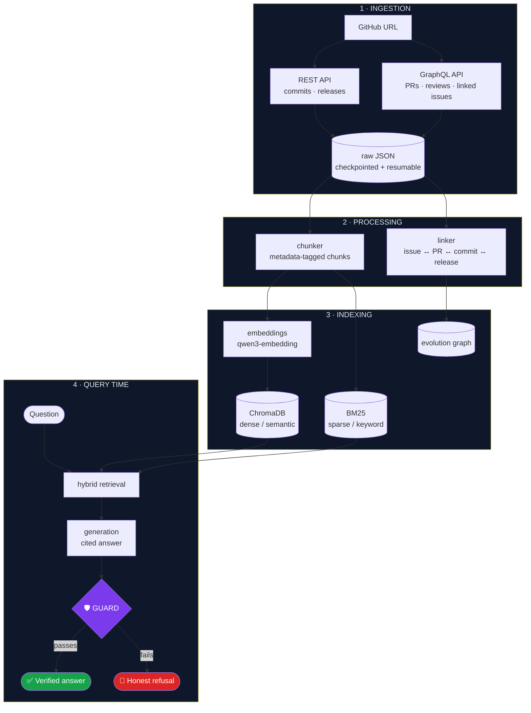
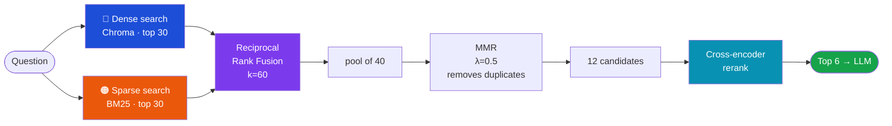
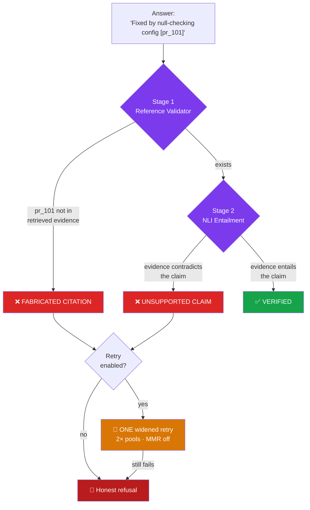
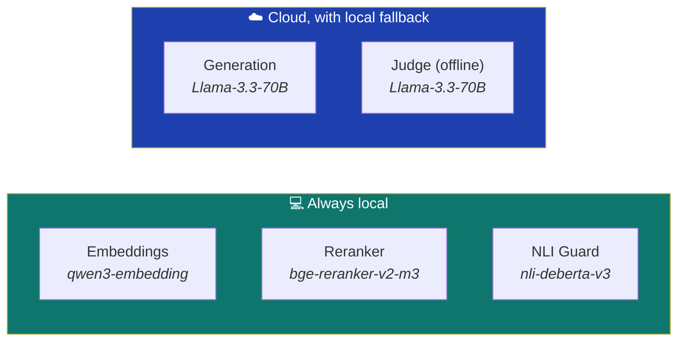

<div align="center">

# 🧠 RepoMind

### Ask a GitHub repository *why* it evolved the way it did

**Git tells you what changed and who changed it. RepoMind tells you why.**

Answers are grounded in real commits, pull requests, issues, reviews and releases —
with clickable citations, and a hallucination guard that **refuses to answer rather than guess**.

[](https://www.python.org/)
[](https://streamlit.io/)
[](https://ollama.com/)
[](https://www.trychroma.com/)
[](#testing)
[](#results)
[](#privacy--offline-operation)

</div>

---

## The problem

You join a project with years of history and find this:

```python
if config is not None:      # ← why is this check here?
    apply(config)
```

`git blame` gives you a name and a date. It does **not** tell you that this line
exists because of a crash reported in issue #1, fixed in PR #101 after a reviewer
asked for a null check, and shipped in v1.2.0.

That reasoning is scattered across four different places on GitHub. Finding it
manually takes hours.

**RepoMind reconstructs it in seconds — and cites its sources.**

---

## What makes it different

Most "chat with your repo" tools retrieve some text and let an LLM talk. The
failure mode is confident nonsense. RepoMind is built around the opposite goal:

> **An answer you cannot verify is worse than no answer.**

Three things enforce that:

| | Guarantee | How |
|---|---|---|
| 🔗 | **Every claim is cited** | Inline `[chunk_id]` markers link to the real GitHub page |
| 🛡️ | **Every citation is verified** | A two-stage guard checks the citation exists *and* actually supports the claim |
| 🚫 | **It says "I don't know"** | Measured **abstention accuracy of 1.00** on questions with no answer in the repo |

---

## See it work

Ask about something that **never happened** in the repository:

> **You:** *Why was the built-in blockchain payment module removed?*
>
> **RepoMind:** *I could not find sufficient evidence in the indexed history to
> answer this question with confidence… rather than guess I'm declining to answer.*

Ask about something **real**:

> **You:** *Why was `isolated_filesystem` deprecated?*
>
> **RepoMind:** *It was deprecated because of its limitations, in favour of
> `pytest`'s `tmp_path` fixture* [`issue_3700`](#) [`pr_2938`](#)
>
> ✅ 4 citations verified · ✅ Grounded (NLI) · 🕸️ 376 evidence links available

> 📸 *Add a screenshot or GIF here — `docs/demo.gif`*

---

## Architecture



### Retrieval pipeline — why two search engines



Each search method fails where the other succeeds:

- **Dense (semantic)** understands meaning — *"why is startup slow?"* finds
  *"app hangs on boot"* with no shared words. But it misses exact tokens.
- **Sparse (BM25)** nails exact tokens — `PR #3700`, `isolated_filesystem`,
  commit SHAs. But it misses paraphrases.

**Reciprocal Rank Fusion** merges them by *rank* rather than score, so the two
systems' incompatible scoring scales don't matter. Then **MMR** removes
near-duplicates, and a **cross-encoder** re-reads each candidate *together with*
the question for a far more accurate final ordering.

### The hallucination guard



Two **independent** checks catch two different failure modes:

1. **Reference validator** — catches *invented* citations (`[pr_99999]` that was
   never retrieved). Pure deterministic set-membership, no LLM involved.
2. **NLI verifier** — catches a *real* citation attached to a *wrong* claim, by
   running natural-language inference between the claim and its cited evidence.

If the guard rejects an answer, the system **retries once** with a widened
retrieval strategy. If that also fails, it **refuses**. It never shows an
unverified answer as verified.

---

## Results

Evaluated on **175 questions across 4 repositories**, in five categories
(factual, causal, cross-commit, evolution, unanswerable).

### The headline metric

<div align="center">

| Repository | Questions | **Abstention accuracy** |
|---|:---:|:---:|
| `pallets/click` | 50 | **1.00** ✅ |
| `psf/requests` | 50 | **1.00** ✅ |
| `acme/widgets` | 25 | **1.00** ✅ |
| `fastapi/fastapi` | 50 | 0.86 |

</div>

**Abstention accuracy** = how often the system correctly refuses when the answer
genuinely isn't in the repository. Most RAG systems *claim* to reduce
hallucination. This measures it.

### Full metrics

| Repository | Faithfulness | Answer relevancy | Recall@6 | Citation precision |
|---|:---:|:---:|:---:|:---:|
| `pallets/click` | 0.75 | 0.86 | 0.52 | 0.54 |
| `psf/requests` | 0.71 | 0.80 | 0.52 | 0.51 |
| `fastapi/fastapi` | 0.59 | 0.80 | 0.66 | 0.42 |
| `acme/widgets` | 0.94 | 0.84 | 0.96 | 0.53 |

### Performance

| Stage | Cloud | Local |
|---|:---:|:---:|
| Retrieval (dense + sparse + rerank) | ~2s | ~2s |
| Generation | **0.7s** | ~10s |
| Guard verification | 0.1–5s | 0.1–5s |
| **Total per question** | **~4s** | **~25s** |

> Cold start adds ~40s while the embedding model loads. Ask one warm-up question
> before a live demo.

---

## Honest limitations

Documented rather than hidden — see [`results/failure_gallery.md`](results/failure_gallery.md)
for 15 real failure cases.

- **Multi-hop "evolution" questions are weakest** (recall 0.30–0.38). Tracing a
  feature across many commits over time is genuinely the hard case.
- **Citation precision ~0.5** — the model often cites *more* evidence than the
  strict ground-truth list. Extra correct-but-unlisted citations count against it.
- **Free-tier API limits are real.** Groq allows ~25 questions/day; bulk
  evaluation falls back to local models automatically.
- **Coverage is a date window**, not full history — scoped deliberately so any
  repository indexes in minutes.

---

## Tech stack

| Layer | Technology | Why |
|---|---|---|
| **Language** | Python 3.11 | ML ecosystem |
| **UI** | Streamlit | Full web UI in pure Python |
| **Data source** | GitHub REST + GraphQL | GraphQL fetches a PR *and* its reviews and linked issues in one call |
| **Vector store** | ChromaDB | Persistent, one collection per repository |
| **Sparse index** | `rank_bm25` | Pure Python, no server |
| **Fusion** | RRF + MMR | Rank-based merge; diversity without losing relevance |
| **Reranker** | `BAAI/bge-reranker-v2-m3` | Cross-encoder — reads query + chunk *together* |
| **Generation** | Groq Llama-3.3-70B ↔ Ollama Qwen-2.5-7B | Cloud quality, local guarantee |
| **Guard** | `cross-encoder/nli-deberta-v3-base` | Entailment checking |
| **Questions** | NVIDIA Nemotron 3 Nano | Reasoning model authors the benchmark |
| **Testing** | pytest | 187 tests |

### Five models, each doing one job



Only generation and the evaluation judge use the cloud. The reranker and guard
are **classifiers, not chatbots** — the right tool per job, not an LLM everywhere.

---

## Privacy & offline operation

**The app runs with zero internet access** (after indexing). Embeddings,
reranking, generation and verification all work locally.

Cloud models are an *optional upgrade*. If a provider is rate-limited, has an
invalid key, or the network is down, the system **automatically falls back to
local** and shows a badge — verified against 7 distinct failure modes.

> A demo cannot fail because a third party did.

---

## Quick start

**Prerequisites:** Python 3.11+, [Ollama](https://ollama.com)

```bash
# 1 · Install
python3.11 -m venv .venv && source .venv/bin/activate
pip install -r requirements.txt

# 2 · Pull the local models
ollama pull qwen3-embedding:0.6b
ollama pull qwen2.5:7b-instruct

# 3 · Configure (GITHUB_TOKEN needs only public_repo scope)
cp .env.example .env      # then add your token

# 4 · Run
streamlit run app.py
```

Open **http://localhost:8501**, paste a repository URL, and ask a question.

<details>
<summary><b>Optional — cloud generation for faster, higher-quality answers</b></summary>

Add to `.env`:

```bash
GENERATION_PROVIDER=api
GENERATION_API_BASE_URL=https://api.groq.com/openai/v1
GENERATION_API_MODEL=llama-3.3-70b-versatile
GENERATION_API_KEY=your_key_here
```

Supported providers: **Groq · Google Gemini · NVIDIA NIM · OpenRouter · Ollama**.
Any failure falls back to local automatically.
</details>

---

## Verification

Two commands keep the project trustworthy over time:

```bash
python scripts/demo_check.py    # before any demo — 9 checks, exits non-zero on failure
python scripts/smoke_test.py    # monthly — catches environment drift
```

`demo_check.py` verifies the things a viewer actually sees: a grounded answer
with clickable citations, the guard catching a fabricated citation, refusal on a
made-up premise, a non-empty evolution graph, and that cloud generation degrades
to local.

### Testing

```bash
pytest -q      # 187 tests
```

---

## Project structure

```
RepoMind/
├── app.py                  # Streamlit UI
├── config.py               # all tunables and model names
├── providers.py            # LLM provider registry (Groq/Gemini/NVIDIA/…)
├── query_pipeline.py       # retrieve → generate → guard → retry → refuse
├── telemetry.py            # per-query metrics
│
├── ingest/                 # GitHub REST + GraphQL, checkpointed
├── process/                # chunker · linker (evolution graph)
├── index/                  # embedder · Chroma + BM25 builders
├── retrieval/              # RRF retriever · MMR · reranker · filters
├── generation/             # prompt builder · answerer (cloud + fallback)
├── guard/                  # reference validator · NLI verifier
├── jobs/                   # background ingestion runner
│
├── eval/                   # golden sets · metrics · runner  (offline only)
├── scripts/                # demo_check · smoke_test · freeze_environment
└── tests/                  # 187 tests
```

> **Architectural rule:** nothing in the live query path may import from `eval/`.
> Delete the entire `eval/` directory and the app still runs.

---

## Documentation

| Document | Purpose |
|---|---|
| [`HOW_TO_RUN.md`](HOW_TO_RUN.md) | Setup, troubleshooting, demo checklist |
| [`DECISIONS.md`](DECISIONS.md) | Every design decision — what, over what, why, at what cost |
| [`HANDOFF.md`](HANDOFF.md) | Contributor guide + settings that must not change |
| [`ENVIRONMENT.md`](ENVIRONMENT.md) | Offline restore procedure |

---

## How the benchmark is built

The 175 evaluation questions are **auto-generated from each repository's real
history**, not hand-written or generic:

1. **Pure Python selects real evidence** — commits with rationale language,
   genuine issue↔PR↔commit clusters from the link graph, keywords recurring
   across dates.
2. **A reasoning model writes the question** from that evidence only.
3. **Unanswerable questions are verified absent** by actually searching for them.

Question generation and grading deliberately use **different providers** —
a model that both writes and marks its own exam exhibits self-preference bias.

---

<div align="center">

**Final-year B.Tech major project** · Built to run locally, verifiably, and offline

*Git shows you what changed. RepoMind shows you why.*

</div>
