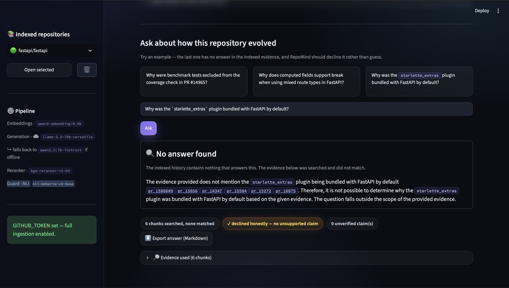
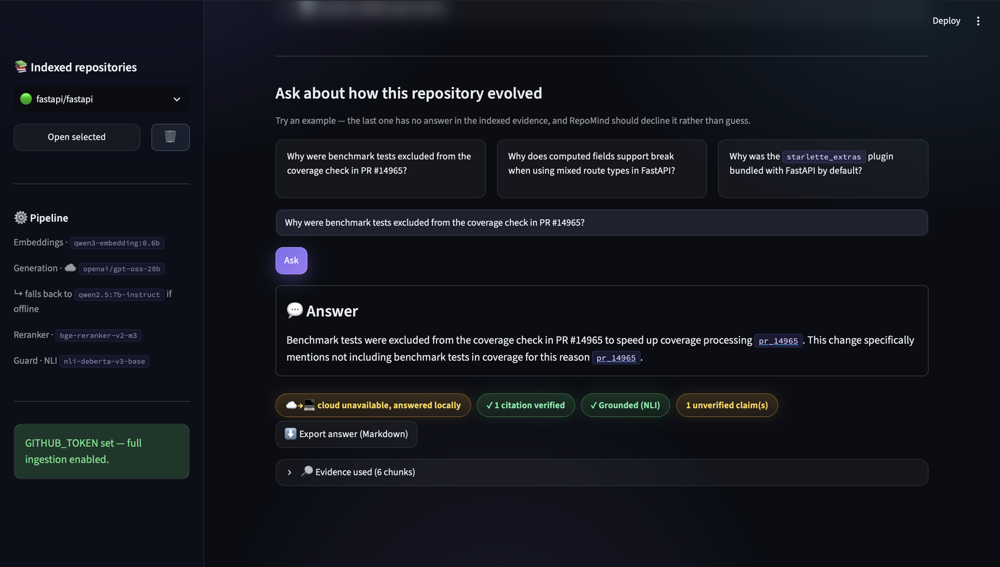
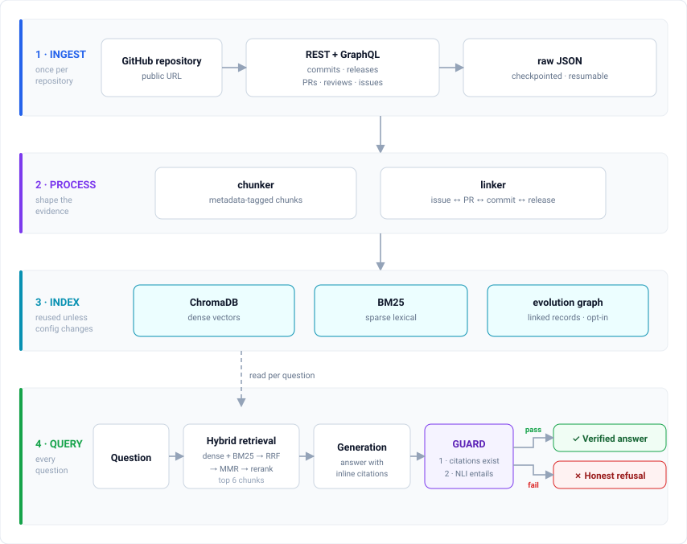
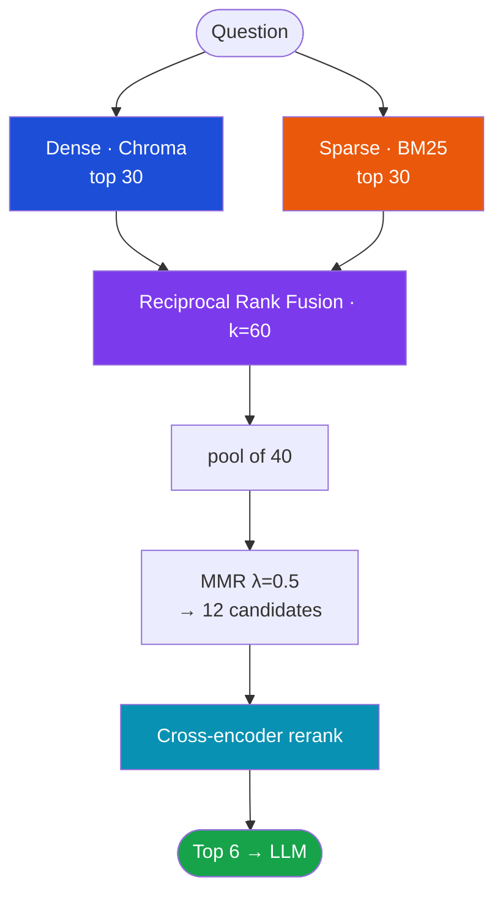
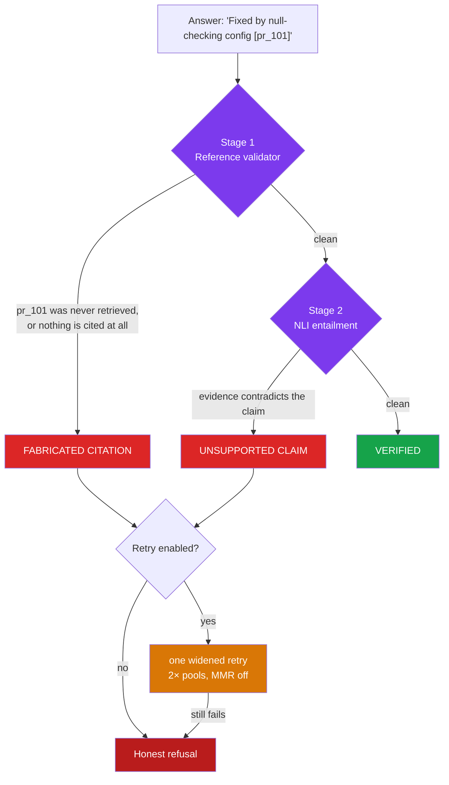

<div align="center">

# RepoMind

**Ask a GitHub repository why it evolved the way it did.**

Answers are grounded in real commits, pull requests, issues and reviews, and
carry inline citations to the exact GitHub page. Every one is verified before you
see it. When the evidence will not support an answer, the system says so.

[](https://www.python.org/)
[](#testing)
[](#results)
[](#how-the-benchmark-is-built)
[](LICENSE)

</div>

---

`git blame` tells you a line changed, who changed it, and when. It does not tell
you that the line exists because of a crash reported in issue #1, fixed in PR
#101 after a reviewer asked for a null check, and shipped in v1.2.0. That
reasoning is scattered across four places on GitHub and takes hours to
reassemble by hand.

RepoMind reassembles it in seconds and cites its sources.

## The design constraint

Most "chat with your repository" tools retrieve some text and let a language
model talk. The failure mode is confident nonsense. This project is built around
the opposite priority:

> **An answer you cannot verify is worse than no answer.**

Three mechanisms enforce it:

- **Every claim carries a citation.** Inline `[chunk_id]` markers resolve to the
  real GitHub URL.
- **Every citation is verified.** A two-stage guard checks that the cited chunk
  was actually retrieved, and that it actually supports the claim.
- **It declines when the evidence isn't there** — measured at **0.90 abstention
  accuracy** across 150 questions whose answers are genuinely absent.

Both examples below are real output from the indexed `fastapi/fastapi`
repository: 1,609 commits, 2,709 pull requests, 5,170 chunks.

Asked about something **real**:

> **Why were benchmark tests excluded from the coverage check in PR #14965?**
>
> *Benchmark tests were excluded from the coverage check in PR #14965 to speed up
> coverage processing* [`pr_14965`]*. This change was made to improve the
> efficiency of the coverage processing, as including benchmark tests was slowing
> it down* [`pr_14965`]*.*
>
> `✓ 1 citation verified` · `✓ Grounded (NLI)` · `1 unverified claim`

The amber badge is the guard working at the level of a single claim rather than
the whole answer. The first sentence is entailed by `pr_14965`; the second
restates it in words the evidence does not literally support, so it is flagged
rather than silently accepted. An all-green answer would tell you less.

Asked about a feature that **never existed**:

> **Why was the `starlette_extras` plugin bundled with FastAPI by default?**
>
> *I could not find sufficient evidence in the indexed history to answer this
> question with confidence. The retrieved material below did not support a
> verifiable answer, so rather than guess I'm declining to answer.*

The second is the one that matters. The guard rejected the first attempt,
retried once with widened retrieval, found nothing, and declined.

<div align="center">
  
  <br>
  <sub><b>Refusing a fabricated premise</b> rather than inventing an answer.</sub>
  <br><br>
  
  <br>
  <sub><b>The same interface answering a real question</b>, every claim cited and every citation checked.</sub>
</div>

---

## Architecture

Stages 1–3 run **once per repository**. Stage 4 runs on every question and never
touches GitHub.

<div align="center">
  
</div>

A fuller version of this diagram — every stage with the module, model and
constant behind it — is in
[`docs/diagrams/pipeline-detailed.svg`](docs/diagrams/pipeline-detailed.svg).

A `manifest.json` fingerprint decides whether an existing index can be reused:
schema version, embedding model, chunker version. Reopening a repository is
therefore instant, while changing the embedding model correctly forces a
rebuild. Ingestion runs in a background process and is checkpointed: kill it
mid-download and it resumes.

### Retrieval



Two search engines, because each fails where the other succeeds. Dense retrieval
understands meaning: *"why is startup slow?"* finds *"app hangs on boot"* with no
shared words. What it misses are exact tokens. BM25 nails `PR #3700`,
`isolated_filesystem` and commit SHAs, but misses paraphrases. Reciprocal Rank
Fusion merges them by *rank*, so their incompatible score scales don't matter and
no per-repository tuning is needed.

### The guard



Two independent checks catch two different failures — both run on every answer,
and an answer is verified only if both come back clean. The **reference
validator** catches invented citations by deterministic set membership, with no
model involved, and also an answer that cites nothing at all, which a
"are the citations valid?" test on its own scores as clean.
The **NLI verifier** catches a real citation attached to a wrong claim, by
running entailment between the claim and its cited evidence. If either fails the
system retries once with widened retrieval when `ENABLE_ADAPTIVE_RETRY` is on —
off by default — then refuses.

---

## Results

### Abstention — the headline

How often the system correctly declines when the answer genuinely isn't in the
repository. Thirty verified-unanswerable questions per repository; each one
confirmed absent by actually searching for it.

| Repository | n | Abstention accuracy | Hallucinated |
|---|:-:|:-:|:-:|
| `pallets/click` | 30 | 0.967 | 1 |
| `psf/requests` | 30 | 0.933 | 2 |
| `fastapi/fastapi` | 30 | 0.900 | 3 |
| `pydantic/pydantic` | 30 | 0.867 | 4 |
| `psf/black` | 30 | 0.833 | 5 |
| **Mean** | **150** | **0.900** | **12** |

An earlier version of this table reported 1.00, on seven questions per
repository. Enlarging the sample lowered it. The lower number is the better
result: it survives the question *"on how many, and which ones?"*

### Answer quality

250 mixed-category questions — 50 per repository — judged by a model from a
different family than the one that answered. A sixth run covers the bundled
`acme_widgets` fixture; it is excluded here because it is not a real repository.

| Repository | Faithfulness | Relevancy | Recall@6 | Citation precision |
|---|:-:|:-:|:-:|:-:|
| `psf/requests` | 0.867 | 0.905 | 0.511 | 0.538 |
| `psf/black` | 0.848 | 0.939 | 0.605 | 0.566 |
| `pallets/click` | 0.777 | 0.919 | 0.510 | 0.486 |
| `fastapi/fastapi` | 0.668 | 0.838 | 0.639 | 0.324 |
| `pydantic/pydantic` | 0.657 | 0.810 | 0.519 | 0.578 |
| **Mean** | **0.763** | **0.882** | **0.557** | **0.499** |

Every figure recomputed directly from `results/eval-*/results.json`; run the
numbers yourself and they will match.

The mixed sets carry their own unanswerable questions, scored independently of
the dedicated abstention sets above. The two samples agree, 0.886 against 0.900, which
corroborates the result across question sets rather than resting it on one.

> **Provenance.** Three models answered these 250 questions. A free tier's daily
> cap is exhausted after a few dozen, after which the chain falls through to a
> smaller cloud model and then to local. Every run records an `answered_by` count
> in its `results.json`, so this is checkable rather than assumed. The honest
> phrasing is *"predominantly cloud-generated, with recorded local fallback."*

### Ablation — what each stage contributes

Eight configurations × 20 questions × 2 repositories, with generation **pinned to
one model** so the comparison isolates the configuration. Mean of both repos:

| Configuration | Recall@6 | Citation precision | Faithfulness |
|---|:-:|:-:|:-:|
| retrieval-only | **0.816** | 0.358 | 0.760 |
| + MMR | 0.536 | 0.365 | 0.573 |
| + MMR + reranker | 0.607 | 0.369 | 0.672 |
| full + guard *(production)* | 0.607 | 0.373 | 0.637 |
| + adaptive retry | 0.684 | 0.361 | 0.630 |
| + graph expansion | 0.665 | 0.321 | 0.680 |
| dense-only | 0.701 | 0.397 | 0.764 |
| **sparse-only (BM25)** | 0.794 | **0.503** | **0.792** |

Three findings, each replicated on both repositories:

**MMR is the most harmful stage.** Isolating it costs −0.280 recall and −0.188
faithfulness. `DECISIONS.md` predicted it in those words, *"diversification can
push a relevant near-duplicate out of the top-k"*, but nobody had measured it. Gold
evidence here is typically a *cluster* of linked records, which is exactly what
MMR discards.

**BM25 alone outperforms the full hybrid pipeline** on every metric shown. That
is the opposite of the assumption behind hybrid retrieval.

**Graph expansion helps end-to-end** but trades precision for recall: +0.058
recall, +0.044 faithfulness, −0.052 citation precision.

**Adaptive retry is the one stage that clearly earns its place**, at +0.077
recall over the production configuration. It is also what turns a guard rejection into
a visible refusal rather than a hedged paragraph, so it is worth enabling:

```bash
ENABLE_ADAPTIVE_RETRY=true      # in .env
```

It is off by default only because every feature flag here defaults to preserving
existing behaviour.

> **Do not over-read this table.** n=20 per configuration, two repositories, and
> a deliberately weak pinned model. The absolute numbers sit well below the
> answer-quality results above and are not system performance. What it supports
> is the *relative ordering*. Acting on it warrants a larger run first.

<details>
<summary>Why the model is pinned</summary>

An earlier run left generation on the normal cloud-with-fallback path.
Configurations execute in order and the daily quota depletes in order, so config
1 got 19/20 answers from a 70B model and config 3 got none. The table appeared to
show pipeline stages hurting; what it showed was the answerer getting weaker.
`eval/ablation.py` now pins the model and records `answered_by` per
configuration, so comparability is verifiable from the artifact.
</details>

### Corpora

Five real repositories across five domains, so results are not an artifact of one
project's conventions.

| Repository | Domain | Commits | PRs | Issues | Chunks | Graph links |
|---|---|-:|-:|-:|-:|-:|
| `fastapi/fastapi` | web framework | 1,609 | 2,709 | 222 | 5,170 | 127 |
| `pydantic/pydantic` | validation | 590 | 1,446 | 1,298 | 3,558 | 650 |
| `psf/black` | formatter | 292 | 901 | 305 | 1,594 | 197 |
| `psf/requests` | HTTP client | 119 | 658 | 412 | 1,260 | 156 |
| `pallets/click` | CLI | 286 | 570 | 158 | 1,059 | 376 |
| `acme/widgets` | fixture | 3 | 2 | 3 | 11 | 4 |

`acme/widgets` is a hand-built fixture for fast deterministic tests, excluded
from all averages.

---

## Limitations

Documented rather than hidden. Fifteen real failure cases are catalogued in
[`results/failure_gallery.md`](results/failure_gallery.md).

- **Abstention is 0.90, not 1.00.** Roughly one unanswerable question in ten
  still receives an answer it should have declined.
- **Multi-hop "evolution" questions are weakest** (recall 0.36–0.39 even with
  graph expansion). Tracing a feature across many commits over time is the hard
  case in retrieval-augmented generation.
- **The ground truth is model-generated.** Questions and reference answers are
  written by a reasoning model from real evidence, so retrieval metrics partly
  measure agreement with another model's judgement. The *unanswerable* set is
  stronger evidence, since each item is verified absent by search.
- **Citation precision ≈ 0.5**, partly an artefact: the model often cites more
  correct evidence than the strict gold list, and extras count against it.
- **Free tiers churn.** In one session Gemini retired two models, Cerebras
  returned 402, and Groq's daily cap ran out. Every role walks a fallback chain
  ending locally, but bulk evaluation genuinely does end up partly local.
- **Coverage is a date window**, not full history — scoped so any repository
  indexes in minutes.

---

## Quick start

Requires Python 3.11+, [Ollama](https://ollama.com), and a GitHub token with
`public_repo` scope.

```bash
git clone https://github.com/sairamsrujan/RepoMind.git
cd RepoMind

python3.11 -m venv .venv && source .venv/bin/activate
pip install -r requirements.txt

ollama pull qwen3-embedding:0.6b
ollama pull qwen2.5:7b-instruct

cp .env.example .env      # add GITHUB_TOKEN
streamlit run app.py
```

Open <http://localhost:8501>, paste a repository URL, ask a question.

> Without a `GITHUB_TOKEN`, pull requests cannot be ingested at all — GitHub's
> GraphQL API requires authentication. REST endpoints still work unauthenticated
> at 60 requests/hour.

<details>
<summary>Optional: cloud generation</summary>

<br>

The app is fully functional offline. Cloud models are an accelerator, not a
dependency — every role falls back to local automatically.

```bash
GENERATION_PROVIDER=api
GENERATION_API_BASE_URL=https://api.groq.com/openai/v1
GENERATION_API_MODEL=openai/gpt-oss-20b
GENERATION_API_KEY=...
```

Supported: Groq, NVIDIA NIM, OpenRouter, Google Gemini, Ollama. See
`.env.example` for the fallback-chain configuration and measured free-tier notes.
</details>

---

## Verification

```bash
python scripts/smoke_test.py       # 11 durability checks — run monthly
python scripts/check_providers.py  # providers + evaluation role models
python scripts/demo_check.py       # what a viewer actually sees
```

`smoke_test.py` is the durability check. It verifies the Python version, free
disk, and that every installed package still matches `requirements.txt` exactly.
It confirms Ollama is up with both pinned tags present, and loads the
HuggingFace models with networking forced off. It then checks the GitHub token,
warning 60 days before any expiry, and opens every index. [`ENVIRONMENT.md`](ENVIRONMENT.md) ranks what can realistically break
over a nine-month gap.

### Testing

```bash
pytest -q      # 267 tests
```

---

## Project structure

```
app.py                  Streamlit UI
config.py               all tunables and model names
providers.py            LLM provider registry + fallback chains
query_pipeline.py       retrieve → generate → guard → retry → refuse
telemetry.py            per-query metrics

core/                   repo URL parsing · manifest · registry · paths
ingest/                 GitHub REST + GraphQL fetchers, checkpointed
process/                chunker · linker (evolution graph)
index/                  embedder · Chroma + BM25 builders
retrieval/              RRF retriever · MMR · reranker · graph expansion
generation/             prompt builder · answerer
guard/                  reference validator · NLI verifier
jobs/                   background ingestion runner

eval/                   golden sets · metrics · runner · ablation (offline only)
results/                evaluation reports + failure gallery
scripts/                smoke_test · check_providers · demo_check
tests/                  267 tests
```

**Architectural rule:** nothing in `retrieval/`, `generation/`, `guard/`,
`jobs/` or `app.py` may import from `eval/`. The in-app evaluation panel launches
`eval/run.py` as a subprocess to preserve this. Delete `eval/` entirely and the
app still runs.

---

## How the benchmark is built

All 400 questions are generated from each repository's real history rather than
hand-written. That is 250 mixed plus 150 unanswerable, across the five real
repositories:

1. **Plain Python selects the evidence.** Commits carrying rationale language
   (`fix`, `because`, `deprecate`), genuine issue↔PR↔commit clusters from the
   link graph, keywords recurring across two or more distinct dates.
2. **A reasoning model writes the question** from that evidence alone.
3. **Unanswerable questions are verified absent** by searching for them; a
   fictional premise is rejected if anything matches. So it is a genuine
   abstention test, not an untested guess.

### Guarding against self-preference bias

Three roles, three different model families, enforced in code:

| Role | Must differ from | Why |
|---|---|---|
| Question author | judge | A model that writes and marks its own exam rewards its own phrasing |
| Answerer | judge | A model grading its own output scores itself generously |

`config.roles_are_distinct()` checks this on canonical model names, since Groq's
`openai/gpt-oss-120b` and Cerebras's `gpt-oss-120b` are the same model in
different packaging. Every `results.json` records the outcome.

This check exists because the bug was real: the judge had been the same model as
the answerer, so faithfulness was partly self-assessed.

---

## Documentation

| Document | Purpose |
|---|---|
| [`HOW_TO_RUN.md`](HOW_TO_RUN.md) | Setup, troubleshooting, demo checklist |
| [`DECISIONS.md`](DECISIONS.md) | Each design decision: chosen / over / because / cost / evidence |
| [`HANDOFF.md`](HANDOFF.md) | Contributor guide and the settings that must not change |
| [`ENVIRONMENT.md`](ENVIRONMENT.md) | Nine-month durability analysis and offline restore |

---

## Author

**R Sai Ram Srujan Kumar** — [@sairamsrujan](https://github.com/sairamsrujan)

Design, implementation and evaluation.

---

<div align="center">

Final-year B.Tech major project · built to run locally, verifiably, offline

</div>
